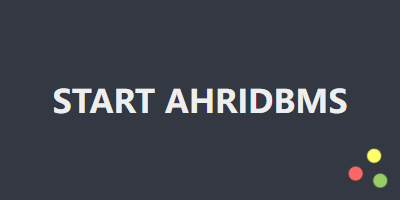

# AhriDBMS Cross-platform Database Management System

[English](.) | [中文简体](./README.md)

[Code Repository](https://git.ahriknow.com/ahriknow/ahridbms-client-rust)

----
Welcome to our new homepage [https://dbms.ahriknow.com/](https://dbms.ahriknow.com/)
----

<div align=center>

</div>
<div align=center>

</div>
<div align=center>

</div>
<div align=center>

</div>

# Features
1. Support multiple databases (continuously updated...)
   - Redis
2. Lightweight
3. Syntax highlighting
4. Syntax tips
   
# Compile from source code
1. Install Rust environment
2. Install Nodejs environment
3. Run Build
   ```shell
   yanr tauri build
   # OR
   npm run tauri build
   ```
4. After the compilation is complete, you can find the executable file in the `./src-tauri/target/release` directory
5. The installation package in the `./src-tauri/target/release/bundle ` directory

# Plan
1. Support more languages
2. Support more databases
   - [x] Redis
   - [ ] MongoDB
   - [ ] PostgreSQL
   - [ ] MySQL
   - [ ] (Other undetermined...)
3. More operations for database
   1. Charts
   2. Models
   3. Relations

# Dependencies
- [Rust](https://www.rust-lang.org/)
- [Nodejs](https://nodejs.org/)
- [tauri](https://tauri.app/)
- [Vue](https://vuejs.org/)
- [Monaco Editor](https://microsoft.github.io/monaco-editor/)
- ...

# License
[Apache License Version 2.0](./LICENSE)

# Copyright
ahriknow
