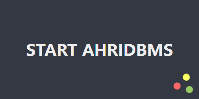
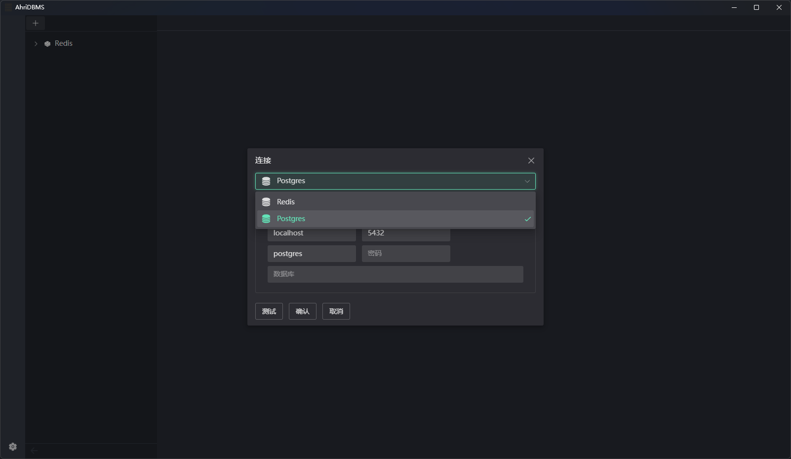
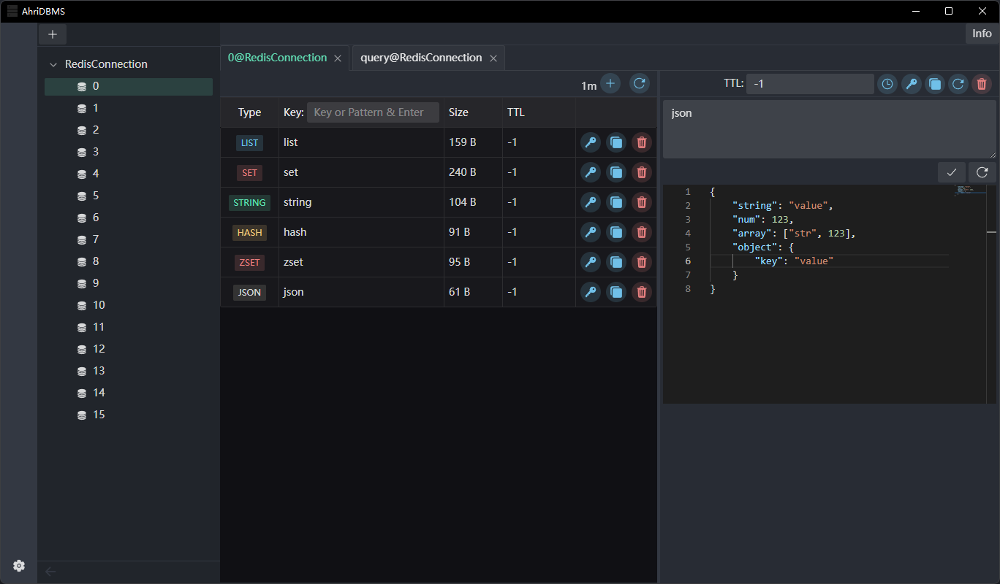
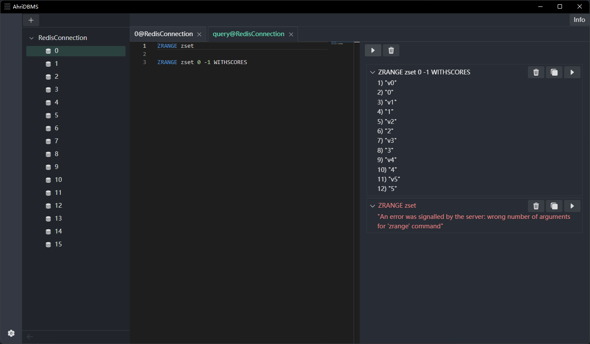
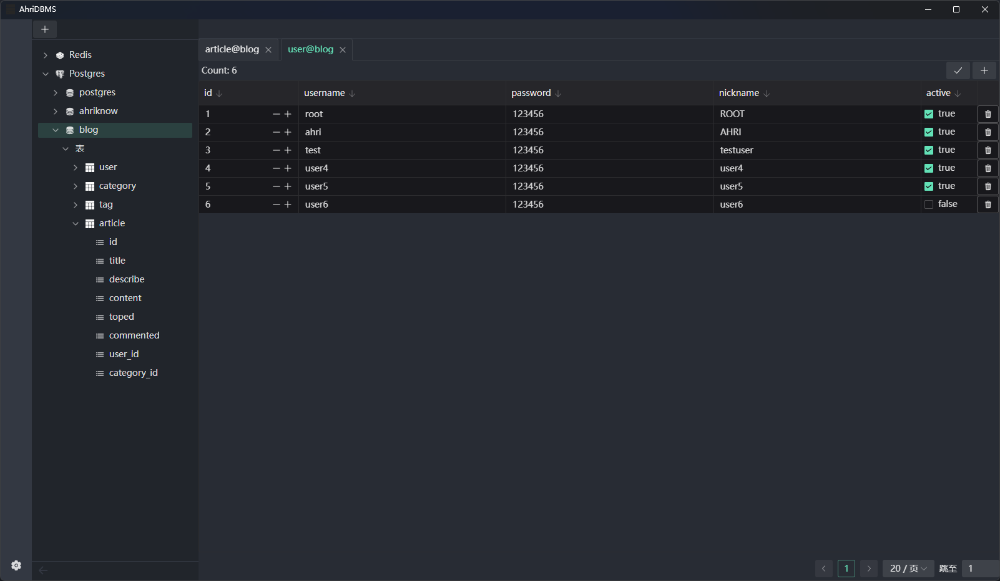
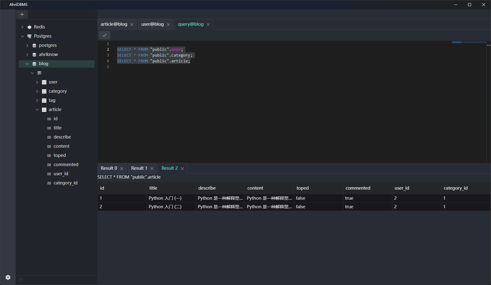

# AhriDBMS 跨平台数据库管理系统

[中文简体](.) | [English](./README.en.md)

[代码仓库](https://git.ahriknow.com/ahriknow/ahridbms-client-rust)

# 下载
#### [欢迎访问我们的网站 https://dbms.ahriknow.com/](https://dbms.ahriknow.com/)

#### 生成并显示文件 SHA256
```cmd
certutil -hashfile ${文件路径} SHA256
```
# 截图

<div align=center>

</div>
<div align=center>

</div>
<div align=center>

</div>
<div align=center>

</div>
<div align=center>

</div>
<div align=center>

</div>

# 功能特色
1. 支持多种数据库 (持续更新中...)
   - Redis
   - Postgres
2. 轻量级
3. 语法高亮
4. 语法提示

# 从源码编译
1. 安装 Rust 环境
2. 安装 Nodejs 环境
3. 开始编译
   ```shell
   yanr tauri build
   # OR
   npm run tauri build
   ```
4. 编译完成后，可在 `./src-tauri/target/release` 目录下找到可执行文件
5. 安装包在 `./src-tauri/target/release/bundle` 目录下

# 计划
1. 支持更多语言
2. 支持更多数据库
   - [x] Redis
   - [x] PostgreSQL
   - [ ] MongoDB
   - [ ] MySQL
   - [ ] (其他未确定...)
3. 数据库更多操作
   1. 图表
   2. 模型
   3. 关系

# Dependencies
- [Rust](https://www.rust-lang.org/)
- [Nodejs](https://nodejs.org/)
- [tauri](https://tauri.app/)
- [Vue](https://vuejs.org/)
- [Monaco Editor](https://microsoft.github.io/monaco-editor/)
- ...

# License
[Apache License Version 2.0](./LICENSE)

# Copyright
ahriknow


